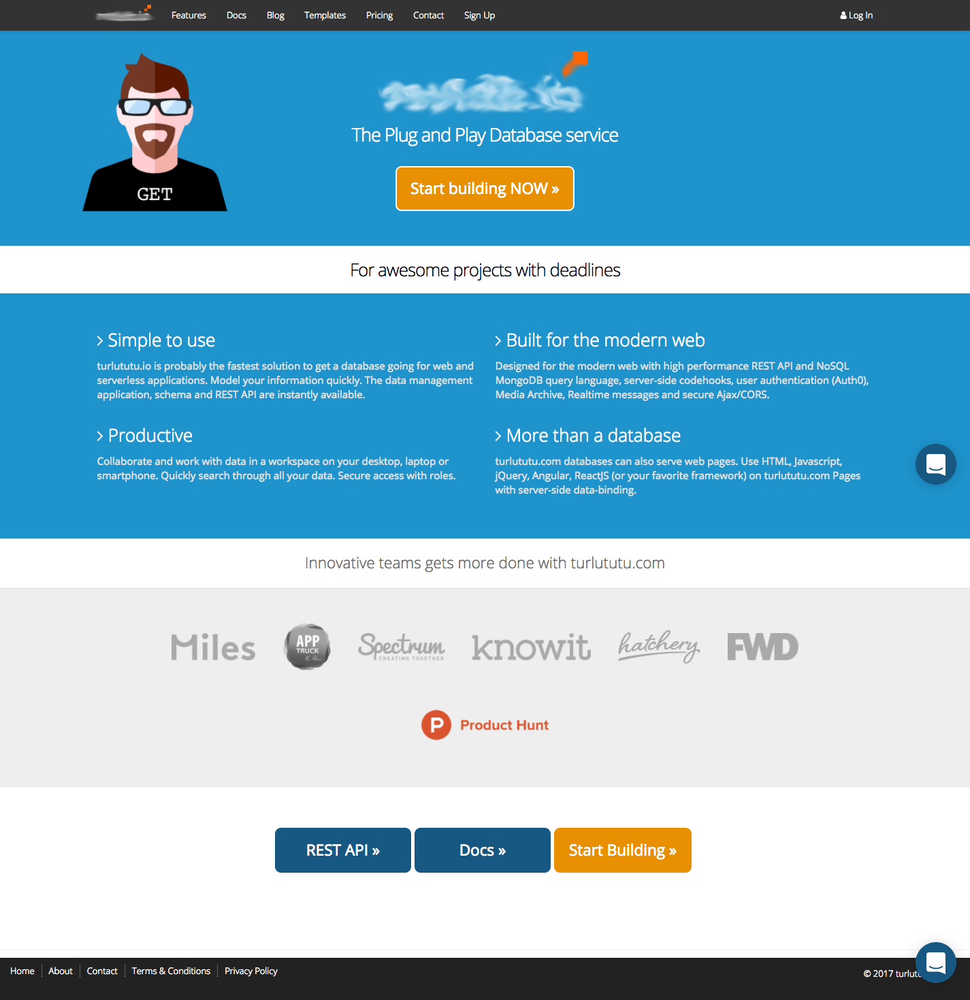

# turltutu.github.io   

- This project consist of a **site** I needed **to copy** for one of my **exercice**.    
- Here is the [*link*](https://gigithegiraffe.github.io/turlututu.github.io/) to my copy.    
- Here is the [*image*](./turlututu.png) to copy.  

---

---

